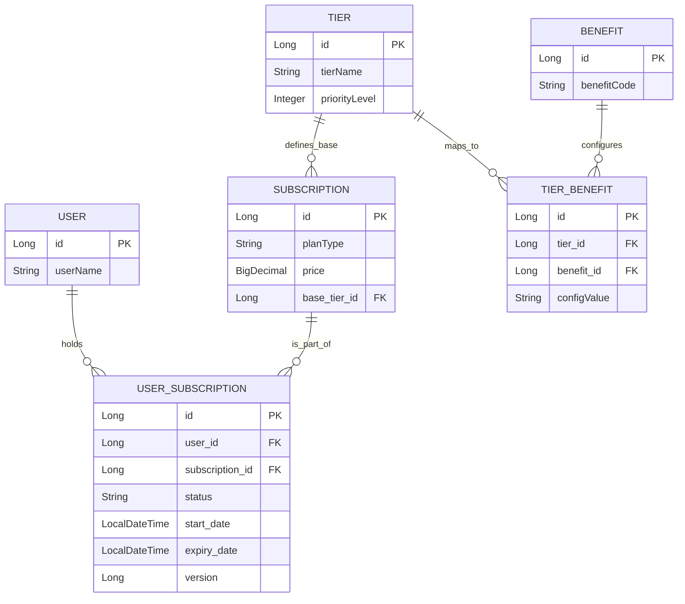
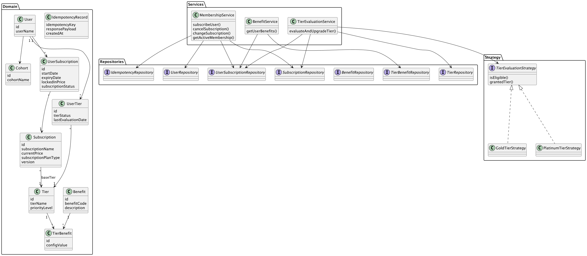

# Enterprise Membership & Rewards Platform

A scalable, resilient, and highly configurable tiered membership backend designed to integrate seamlessly with high-traffic e-commerce checkout engines. 

## 🚀 Architectural Highlights

This system was engineered to handle real-world edge cases, concurrent traffic, and evolving business requirements without requiring constant code deployments.

* **Idempotent Checkout API:** Implements a Stripe-style Idempotency wrapper using network-level keys to completely eliminate race conditions and prevent double-charging during network retries.
* **Enterprise Audit Trail (Append-Only):** User contracts are immutable. Upgrades and downgrades do not overwrite database rows; they close existing contracts and append new ones, providing a perfect financial history. 
* **Optimistic Locking:** Utilizes database-level versioning (`@Version`) to prevent concurrent modification anomalies when updating active subscription states.
* **Data-as-Code (Configurable Perks):** Built a normalized bridge architecture (`TierBenefit`) that maps dynamic checkout perks (like Free Shipping or Extra Discounts) to specific Tiers without hardcoding business logic into the application layer.
* **Rules Engine (Strategy Pattern):** The `TierEvaluationStrategy` isolates the logic for user upgrades (evaluating spend, cohort, or order volume), strictly adhering to the Open/Closed Principle.

## 🗄️ Entity Relationship Architecture






### 🗄️ System Architecture & Core Components

The backend is structured using strict separation of concerns, isolating network traffic from business invariants and data persistence.

**1. The Web Layer (Controllers & Idempotency)**
Traffic enters via `MembershipController` and `UserMembershipController`. This layer acts as a strict boundary. It extracts HTTP headers (like `Idempotency-Key`) and passes them to a Service-level Facade wrapper, immediately rejecting duplicate network requests before they can interact with the core domain.

**2. The Service Layer & Strategy Pattern**
The heart of the system (`MembershipService`, `BenefitService`) orchestrates the transactions. The tier-upgrade logic is entirely abstracted using the **Strategy Pattern** (`TierEvaluationStrategy`). This allows the system to seamlessly evaluate users based on different metrics (total spend, cohort, or order count) without modifying the core service layer, adhering strictly to the Open/Closed Principle.

**3. The Persistence Layer (Optimized Data Access)**
Data access is handled by Spring Data JPA with a focus on high-throughput performance. We utilize **`@EntityGraph`** on the `BenefitRepository` to fetch complex, multi-table perk configurations in a single SQL query. This prevents the classic N+1 query performance trap from bottlenecking the checkout engine.

**4. Concurrency & State Management**
State mutations are strictly controlled. The system utilizes an **Append-Only** ledger for user contracts rather than in-place `UPDATE`s. When state changes occur (like a cancellation or upgrade), old rows are closed and new ones are generated. These mutations are guarded by Hibernate's **Optimistic Locking** (`@Version`) to guarantee zero race conditions under heavy load.

## 🛠️ Tech Stack

* **Core:** Java 17+, Spring Boot 3
* **Data:** Spring Data JPA, Hibernate, H2 (In-Memory) / PostgreSQL
* **API Documentation:** OpenAPI (Swagger 3)
* **Design Patterns:** Strategy, Facade, Builder

## 🏃‍♂️ Quick Start & Demo

1. Clone the repository to your local machine.
2. Run the application via Maven:
```bash
mvn spring-boot:run

```


3. **The system is self-seeding.** Upon startup, the `CommandLineRunner` automatically executes a full integration lifecycle:
* Loads the global benefits dictionary.
* Maps dynamic perks to Silver/Gold/Platinum tiers.
* Creates a test user with an active Silver contract.
* Simulates a high-value $1,200 checkout event, triggering the Rules Engine to safely upgrade the user to Platinum while preserving the audit history.


## 📖 API Documentation (Swagger)

Once the application is running, interactive API documentation is automatically generated. You can test the Idempotency constraints, simulate race conditions, and view paginated histories directly from the browser.

* **Swagger UI:** [http://localhost:8080/swagger-ui.html](https://www.google.com/search?q=http://localhost:8080/swagger-ui.html)
